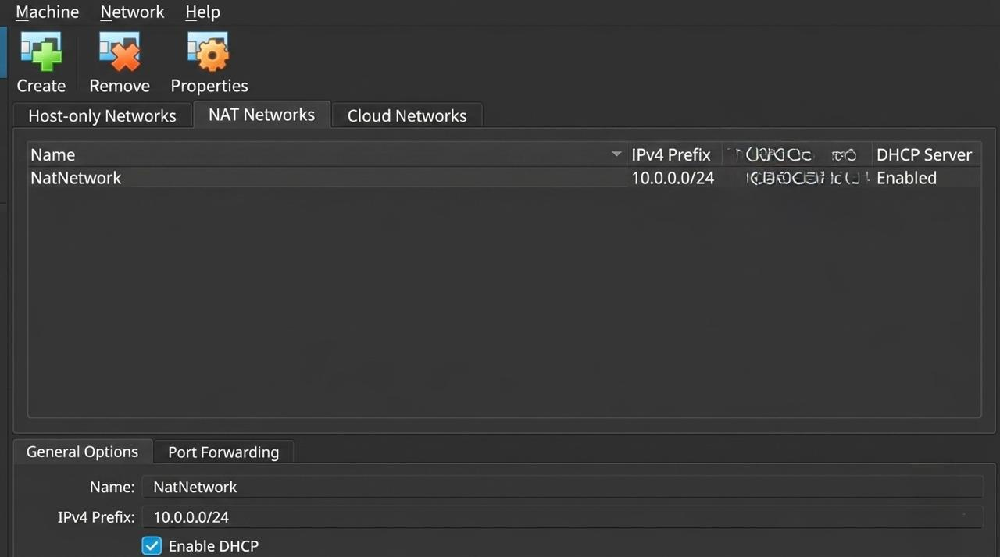
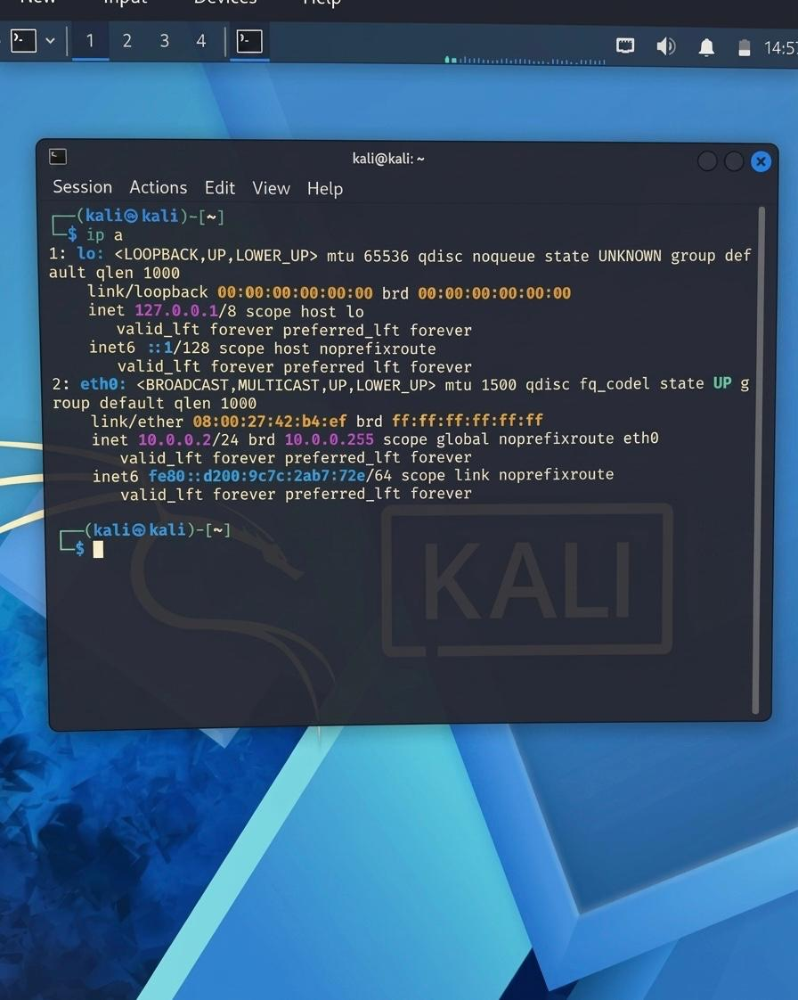
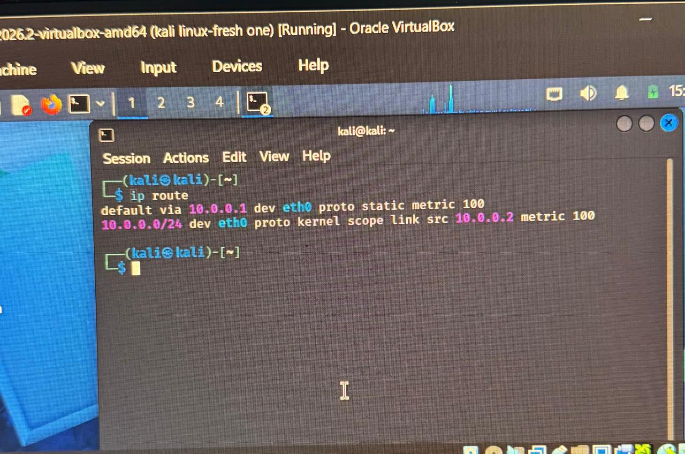
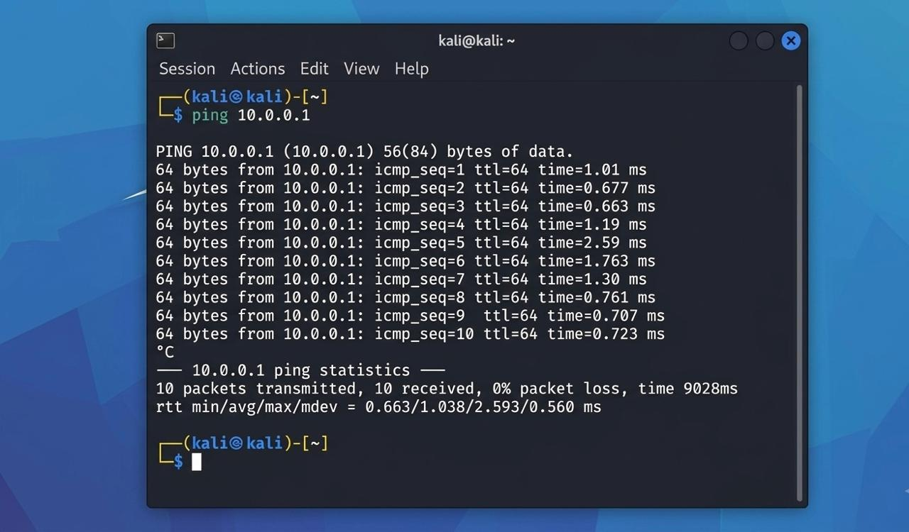
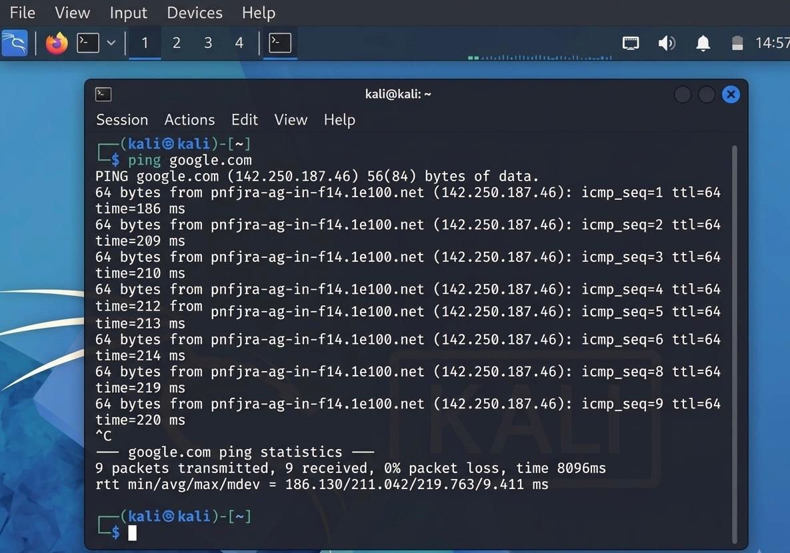
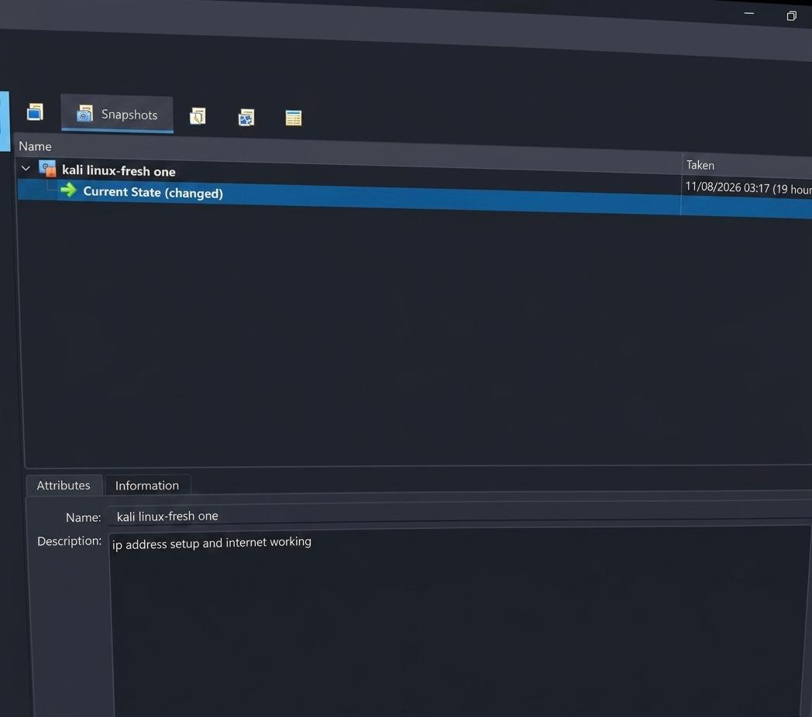

# Week 1 — Cybersecurity Lab Setup: VirtualBox + Kali Linux

  

## Project Overview

This project documents my Week 1 cybersecurity lab setup using **VirtualBox** and **Kali Linux**.
The lab provides a safe sandbox for penetration testing, ethical hacking practice, and network security experiments without risking my host machine or home network.

---

## Lab Environment Details

| Component    | Details                 |
|--------------|-------------------------|
| Host Machine | Intel Core i5, Windows 11 |
| VirtualBox   | 7.2.14                  |
| Guest OS     | Kali Linux 2026.2       |
| VM Resources | 2048 MB RAM, 2 processors |
| Network Type | NAT Network             |
| IP Range     | 10.0.0.0/24             |

---

## Step-by-Step Setup

### 1. Installed VirtualBox on the host machine

VirtualBox was installed on the host machine.

### 2. Created a NAT Network with IP range `10.0.0.0/24`

A dedicated NAT Network was created in VirtualBox with the IPv4 prefix `10.0.0.0/24` and DHCP enabled.

### 3. Imported the Kali Linux VM into VirtualBox

The Kali Linux virtual machine was imported into VirtualBox and attached to the NAT Network.

### 4. Configured the IP settings for Kali Linux

The Kali VM was configured with the static IP address `10.0.0.2/24` and default gateway `10.0.0.1`.

`ip a` output showing `10.0.0.2/24` on `eth0`:

`ip route` output showing the default route via `10.0.0.1`:

### 5. Verified connectivity with ping tests

The Kali VM was tested for gateway, internet, and DNS connectivity.

Gateway reachable (`ping 10.0.0.1`, 0% packet loss):

Internet and DNS resolution working (`ping google.com`, 0% packet loss):

### 6. Captured a snapshot for rollback and backup

A baseline snapshot was created after the IP setup and internet connectivity were working, allowing rollback and recovery.

---

## Verification Tests

- `ping 10.0.0.1` → Gateway reachable
- `ip a` output confirms correct IP assignment
- `ip route` confirms default gateway
- `ping google.com` → Internet and DNS working
- `ping <other VM IP>` → VM-to-VM connectivity

---

## Problems Faced & Solutions

- **Issue**: Kali VM had no internet access.
  **Solution**: Adjusted NAT Network DHCP settings and restarted the VM.

## Snapshot & Backup Strategy

- Created snapshots after each major configuration step.
- Stored backup copies of VM images on an external drive.
- Ensured rollback points for safe experimentation.

## What I Learned

- How to configure VirtualBox networking.
- Importance of snapshots for safe rollback.
- Basics of Kali Linux network troubleshooting.
- Value of documenting every step for reproducibility.

## Tools & References

- [VirtualBox](https://virtualbox.org)
- [Kali Linux](https://kali.org)
- [7-Zip](https://7-zip.org)

## Author

**Kovilen Sookalingum**
Batch: B082
LinkedIn: [linkedin.com/in/kovilen-sookalingum-500644327](https://www.linkedin.com/in/kovilen-sookalingum-500644327)
